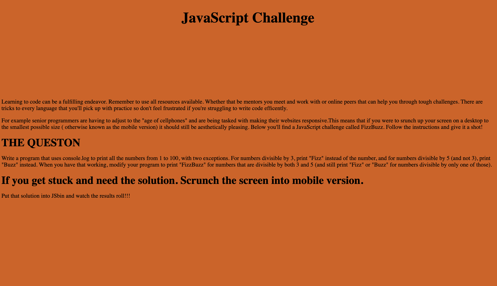

# FizzBuzz is a javascript challenge that Resilient Coders have to solve.

## Link to Challenge
https://zikrefizzbuzz.netlify.com/

## How It's Made:

## Tech used: HTML, CSS & JavaScript

This FizzBuzz Challenge was made using HTML, CSS & JavaScript.

## Lessons Learned:

This was a simple site to make. I added a twist in the mobile version.

## Examples:

https://github.com/zikrehaimanot/todo-list-2019-week05/tree/answer

https://github.com/zikrehaimanot/calculator

https://github.com/zikrehaimanot/rpsGame

https://github.com/zikrehaimanot/foodist
